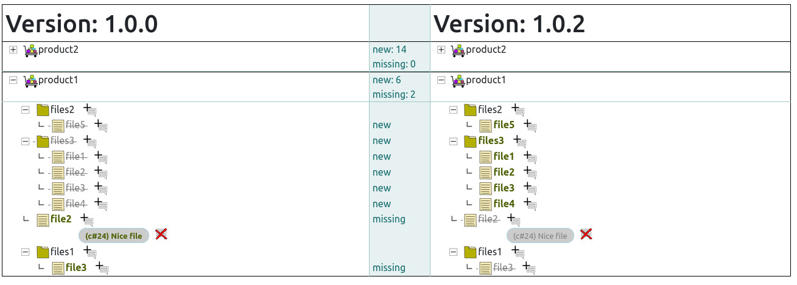

# web-diff-files-tree

Service which allowed loading filepaths by api. 
After this you can compare different `version` and set comment to files.



## Database creation 

1. Create empty database 
via console client for mysql:


```
$ mysql
> CREATE DATABASE `webdiff` CHARACTER SET utf8 COLLATE utf8_general_ci;
> CREATE USER 'webdiffu'@'localhost' IDENTIFIED BY 'jET3E4W9vm';
> GRANT ALL PRIVILEGES ON webdiff.* TO 'webdiffu'@'localhost' WITH GRANT OPTION;
> FLUSH PRIVILEGES;
```

Edit `www/conf.d/config.php` for set correct credentials:


2. Apply updates:

```
$ cd www
$ php update_db.php
```

```
$ docker-compose up
```

http://localhost:8071/

env variables:

- WEBDIFF_DB_HOST
- WEBDIFF_DB_NAME
- WEBDIFF_DB_USER
- WEBDIFF_DB_PASS
- WEBDIFF_DB_PORT
